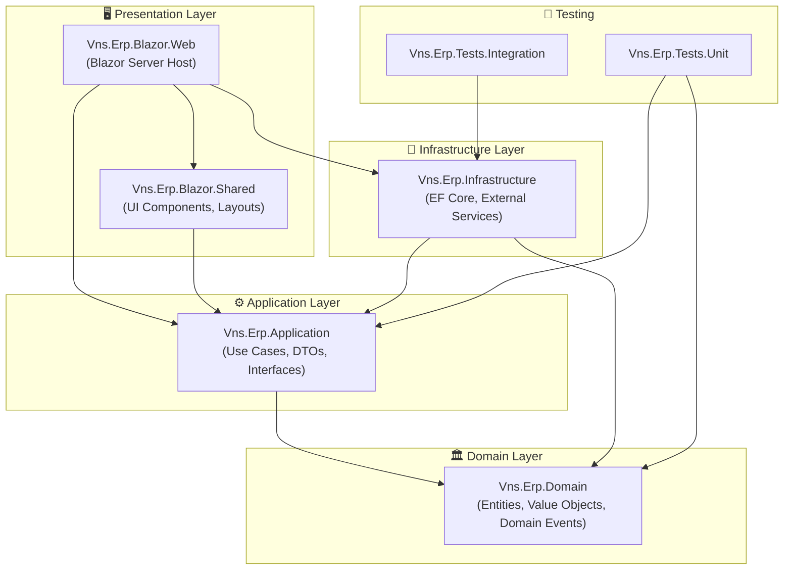

# Phân Tích & Đề Xuất Cấu Trúc Dự Án Vns-Epr-Blazor-2026

> Tài liệu phân tích từ góc nhìn **Project Manager / Solution Architect** cho dự án .NET Enterprise

---

## 1. Phân Tích Hiện Trạng

### 1.1. Kiến Trúc Hiện Tại — Single-Project Monolith

```
Vns-Epr-Blazor-2026/              ← Solution root
└── Vns-Epr-Blazor-2026/          ← Duy nhất 1 project
    ├── Components/
    │   ├── Account/               ← Identity UI (Login, Register, etc.)
    │   ├── Layout/                ← MainLayout, NavMenu, Drawer
    │   ├── Pages/                 ← Counter, Weather, Error, Index
    │   └── Shared/                ← DrawerStateComponentBase
    ├── Data/
    │   ├── ApplicationDbContext   ← EF Core (trống, chỉ kế thừa IdentityDbContext)
    │   ├── ApplicationUser        ← IdentityUser (trống)
    │   └── Migrations/
    ├── Services/
    │   └── OpenAIServiceSettings  ← Chỉ có 1 file cấu hình
    ├── wwwroot/                   ← Static assets (css, images, favicon)
    ├── Program.cs                 ← DI, middleware, routing
    └── appsettings.json
```

### 1.2. Đánh Giá Nhanh

| Tiêu chí | Đánh giá | Ghi chú |
|---|---|---|
| **Separation of Concerns** | ⚠️ Yếu | Tất cả logic, data, UI nằm trong 1 project |
| **Testability** | ❌ Chưa có | Không có test project, không có interface abstraction |
| **Scalability** | ⚠️ Hạn chế | Không thể scale team, không thể tái sử dụng module |
| **CI/CD** | ⚠️ Chưa sẵn sàng | `.github/workflows/` trống, thiếu Dockerfile |
| **Domain Modeling** | ❌ Thiếu | `ApplicationUser` và `DbContext` trống hoàn toàn |
| **Configuration** | ✅ Cơ bản | Secret management, appsettings đúng chuẩn |
| **Technology Stack** | ✅ Hiện đại | .NET 10, DevExpress Blazor 25.2, AI Integration |

### 1.3. Bài Học Từ Reference Source Code

Hai mẫu reference cho thấy pattern chuyên nghiệp từ DevExpress:

**BlazorDemo.ServerSide** — Multi-project:
- `BlazorDemo.ServerSide.Core` (shared library: Pages, Data, Services, Utils, Configuration)
- `BlazorDemo.DemoData` (Models, Search, Utils — tách biệt dữ liệu)
- `BlazorDemo.Reporting.Core` (Services, Signatures — tách biệt reporting)
- `BlazorDemo.ServerSide` (host project: Controllers, DataProviders, Startup)

**BlazorDemo.Showcase** — Auto/Manual render mode:
- `BlazorDemo.Showcase` (server host: Components, Data)
- `BlazorDemo.Showcase.Client` (client-side: Components, Models, Services, Utils, Tools)

---

## 2. Đề Xuất Cấu Trúc Chuyên Nghiệp

### 2.1. Kiến Trúc Tổng Quan — Clean Architecture + Feature-Sliced



### 2.2. Cấu Trúc Thư Mục Chi Tiết

```
Vns-Epr-Blazor-2026/                          ← Git Repository Root
│
├── .github/
│   ├── workflows/
│   │   ├── ci.yml                             ← Build + Test on PR
│   │   ├── cd-staging.yml                     ← Deploy to Staging
│   │   └── cd-production.yml                  ← Deploy to Production
│   ├── PULL_REQUEST_TEMPLATE.md
│   └── copilot-instructions.md                ← (đã có)
│
├── docs/                                      ← 📚 Tài liệu dự án
│   ├── architecture/
│   │   ├── adr/                               ← Architecture Decision Records
│   │   │   └── 001-blazor-server-over-wasm.md
│   │   ├── c4-context.md                      ← C4 Diagrams
│   │   └── tech-stack.md
│   ├── guides/
│   │   ├── getting-started.md                 ← Onboarding cho dev mới
│   │   ├── coding-conventions.md
│   │   └── deployment.md
│   ├── api/                                   ← API documentation (nếu có)
│   └── changelog/
│       └── CHANGELOG.md
│
├── src/                                       ← 🏗️ Source Code
│   │
│   ├── Vns.Erp.Domain/                        ← 🏛️ Domain Layer (Pure C#, zero deps)
│   │   ├── Vns.Erp.Domain.csproj
│   │   ├── Common/
│   │   │   ├── BaseEntity.cs                  ← Id, CreatedDate, ModifiedDate
│   │   │   ├── AuditableEntity.cs             ← CreatedBy, ModifiedBy
│   │   │   ├── ISoftDeletable.cs
│   │   │   └── DomainEvent.cs
│   │   ├── Identity/
│   │   │   └── ApplicationUser.cs
│   │   ├── Inventory/                         ← Feature: Quản lý kho
│   │   │   ├── Entities/
│   │   │   │   ├── StockInOutMaster.cs
│   │   │   │   ├── StockInOutDetail.cs
│   │   │   │   └── InventoryBalance.cs
│   │   │   ├── Enums/
│   │   │   │   └── StockInOutType.cs
│   │   │   └── Events/
│   │   │       └── StockTransactionCreatedEvent.cs
│   │   ├── Sales/                             ← Feature: Bán hàng
│   │   │   ├── Entities/
│   │   │   └── Enums/
│   │   ├── Purchasing/                        ← Feature: Mua hàng
│   │   │   ├── Entities/
│   │   │   └── Enums/
│   │   └── Accounting/                        ← Feature: Kế toán
│   │       ├── Entities/
│   │       └── Enums/
│   │
│   ├── Vns.Erp.Application/                   ← ⚙️ Application Layer
│   │   ├── Vns.Erp.Application.csproj
│   │   ├── Common/
│   │   │   ├── Interfaces/
│   │   │   │   ├── IApplicationDbContext.cs
│   │   │   │   ├── ICurrentUserService.cs
│   │   │   │   └── IDateTimeService.cs
│   │   │   ├── Behaviors/                     ← MediatR Pipeline
│   │   │   │   ├── ValidationBehavior.cs
│   │   │   │   ├── LoggingBehavior.cs
│   │   │   │   └── PerformanceBehavior.cs
│   │   │   ├── Mappings/
│   │   │   │   └── MappingProfile.cs
│   │   │   └── Exceptions/
│   │   │       ├── NotFoundException.cs
│   │   │       └── ValidationException.cs
│   │   ├── Inventory/
│   │   │   ├── Commands/
│   │   │   │   ├── CreateStockIn/
│   │   │   │   │   ├── CreateStockInCommand.cs
│   │   │   │   │   ├── CreateStockInCommandHandler.cs
│   │   │   │   │   └── CreateStockInCommandValidator.cs
│   │   │   │   └── CreateStockOut/
│   │   │   ├── Queries/
│   │   │   │   ├── GetStockBalance/
│   │   │   │   └── GetStockTransactions/
│   │   │   └── DTOs/
│   │   │       ├── StockInOutMasterDto.cs
│   │   │       └── InventoryBalanceDto.cs
│   │   ├── Sales/
│   │   ├── Purchasing/
│   │   └── DependencyInjection.cs
│   │
│   ├── Vns.Erp.Infrastructure/                ← 🔧 Infrastructure Layer
│   │   ├── Vns.Erp.Infrastructure.csproj
│   │   ├── Persistence/
│   │   │   ├── ApplicationDbContext.cs
│   │   │   ├── Configurations/                ← EF Core Fluent API
│   │   │   │   ├── Identity/
│   │   │   │   │   └── ApplicationUserConfiguration.cs
│   │   │   │   ├── Inventory/
│   │   │   │   │   ├── StockInOutMasterConfiguration.cs
│   │   │   │   │   └── InventoryBalanceConfiguration.cs
│   │   │   │   └── Sales/
│   │   │   ├── Interceptors/
│   │   │   │   ├── AuditableEntityInterceptor.cs
│   │   │   │   └── SoftDeleteInterceptor.cs
│   │   │   ├── Migrations/
│   │   │   └── Seeds/
│   │   │       ├── DefaultRolesSeeder.cs
│   │   │       └── DefaultUsersSeeder.cs
│   │   ├── ExternalServices/
│   │   │   ├── OpenAI/
│   │   │   │   ├── OpenAIServiceSettings.cs
│   │   │   │   └── ChatService.cs
│   │   │   └── Email/
│   │   │       └── EmailSender.cs
│   │   ├── Identity/
│   │   │   └── IdentityService.cs
│   │   └── DependencyInjection.cs
│   │
│   ├── Vns.Erp.Blazor.Shared/                 ← 🧩 Shared Blazor Components
│   │   ├── Vns.Erp.Blazor.Shared.csproj
│   │   ├── Components/
│   │   │   ├── Common/                        ← Shared UI atoms
│   │   │   │   ├── VnsDataGrid.razor
│   │   │   │   ├── VnsLookupEditor.razor
│   │   │   │   └── VnsConfirmDialog.razor
│   │   │   ├── Inventory/                     ← Feature-specific components
│   │   │   │   ├── StockInOutForm.razor
│   │   │   │   └── InventoryBalanceView.razor
│   │   │   └── Reports/
│   │   ├── Layouts/
│   │   │   ├── MainLayout.razor
│   │   │   ├── NavMenu.razor
│   │   │   └── Drawer.razor
│   │   └── _Imports.razor
│   │
│   └── Vns.Erp.Blazor.Web/                    ← 🖥️ Blazor Server Host (Entry Point)
│       ├── Vns.Erp.Blazor.Web.csproj
│       ├── Components/
│       │   ├── App.razor
│       │   ├── Routes.razor
│       │   ├── Pages/                         ← Page-level routing only
│       │   │   ├── Index.razor
│       │   │   ├── Inventory/
│       │   │   │   ├── StockInOutList.razor
│       │   │   │   └── StockInOutDetail.razor
│       │   │   └── Dashboard/
│       │   │       └── Dashboard.razor
│       │   └── Account/                       ← Identity pages (giữ nguyên)
│       ├── wwwroot/
│       │   ├── css/
│       │   ├── images/
│       │   └── favicon.ico
│       ├── Properties/
│       │   └── launchSettings.json
│       ├── Program.cs
│       ├── appsettings.json
│       ├── appsettings.Development.json
│       ├── appsettings.Staging.json
│       ├── appsettings.Production.json
│       └── Dockerfile
│
├── tests/                                     ← 🧪 Testing
│   ├── Vns.Erp.Tests.Unit/
│   │   ├── Vns.Erp.Tests.Unit.csproj
│   │   ├── Domain/
│   │   │   └── Inventory/
│   │   └── Application/
│   │       └── Inventory/
│   └── Vns.Erp.Tests.Integration/
│       ├── Vns.Erp.Tests.Integration.csproj
│       ├── Persistence/
│       └── WebTests/
│
├── tools/                                     ← 🛠️ Dev Tooling
│   ├── scripts/
│   │   ├── seed-db.ps1
│   │   └── reset-migrations.ps1
│   └── docker/
│       ├── docker-compose.yml
│       └── docker-compose.override.yml
│
├── Vns-Epr-Blazor-2026.slnx                  ← Solution file (all projects)
├── .editorconfig                              ← Code style enforcement
├── .gitignore
├── Directory.Build.props                      ← Shared MSBuild properties
├── Directory.Packages.props                   ← Central Package Management
├── global.json                                ← SDK version pinning
├── nuget.config                               ← DevExpress NuGet feed
└── README.md
```

---

## 3. Giải Thích Kiến Trúc

### 3.1. Tại Sao Clean Architecture?

| Lợi ích | Chi tiết |
|---|---|
| **Testable** | Domain & Application layer không phụ thuộc framework → unit test dễ dàng |
| **Flexible** | Thay đổi DB (SQL Server → PostgreSQL) chỉ ảnh hưởng Infrastructure |
| **Team-scalable** | Mỗi dev/team có thể làm việc trên feature riêng mà không conflict |
| **Maintainable** | Mỗi layer có responsibility rõ ràng, dễ debug |
| **Reusable** | Shared components có thể dùng cho WASM/MAUI trong tương lai |

### 3.2. Dependency Flow

```
Domain ← Application ← Infrastructure
                    ↑
          Blazor.Web (Host) → Blazor.Shared
```

- **Domain** không reference bất kỳ project nào (pure C#)
- **Application** chỉ reference Domain
- **Infrastructure** reference Domain + Application (implement interfaces)
- **Blazor.Web** reference tất cả (DI composition root)

### 3.3. Feature Organization (Vertical Slice trong mỗi Layer)

Mỗi module nghiệp vụ ERP (Inventory, Sales, Purchasing, Accounting...) được tổ chức **xuyên suốt** qua tất cả layers:

```
Inventory feature:
  Domain/Inventory/         → Entities, Enums, Events
  Application/Inventory/    → Commands, Queries, DTOs
  Infrastructure/.../Inventory/ → EF Configurations
  Blazor.Shared/Components/Inventory/ → UI Components
  Blazor.Web/Pages/Inventory/ → Routing pages
```

---

## 4. Các File Quản Trị Dự Án Quan Trọng

### 4.1. `Directory.Build.props` — Shared Properties

```xml
<Project>
  <PropertyGroup>
    <TargetFramework>net10.0</TargetFramework>
    <Nullable>enable</Nullable>
    <ImplicitUsings>enable</ImplicitUsings>
    <TreatWarningsAsErrors>true</TreatWarningsAsErrors>
  </PropertyGroup>
</Project>
```

### 4.2. `Directory.Packages.props` — Central Package Management

```xml
<Project>
  <PropertyGroup>
    <ManagePackageVersionsCentrally>true</ManagePackageVersionsCentrally>
  </PropertyGroup>
  <ItemGroup>
    <PackageVersion Include="DevExpress.Blazor" Version="25.2.*" />
    <PackageVersion Include="DevExpress.AIIntegration.Blazor" Version="25.2.*" />
    <PackageVersion Include="Microsoft.EntityFrameworkCore.SqlServer" Version="10.0.0" />
    <!-- ... -->
  </ItemGroup>
</Project>
```

### 4.3. `global.json` — SDK Pinning

```json
{
  "sdk": {
    "version": "10.0.100",
    "rollForward": "latestPatch"
  }
}
```

---

## 5. So Sánh: Hiện Tại vs Đề Xuất

| Khía cạnh | Hiện tại | Đề xuất |
|---|---|---|
| **Số projects** | 1 | 6 (Domain, Application, Infrastructure, Shared, Web, Tests) |
| **Separation of Concerns** | Tất cả trong 1 project | Mỗi layer là 1 project riêng |
| **Domain Model** | Trống | Feature-based entities (Inventory, Sales, etc.) |
| **Business Logic** | Inline trong Blazor pages | CQRS pattern với MediatR |
| **Data Access** | Trực tiếp DbContext | Repository + Specifications |
| **Testing** | Không có | Unit + Integration tests |
| **CI/CD** | Trống | GitHub Actions pipelines |
| **Docs** | Không có | ADR, coding guides, API docs |
| **Package Management** | Per-project | Central Package Management |
| **Containerization** | Không có | Dockerfile + docker-compose |

---

## 6. Lộ Trình Triển Khai (Từng Bước)

> [!IMPORTANT]
> Không nên refactor tất cả cùng lúc. Nên tiến hành theo phase.

### Phase 1 — Foundation (Tuần 1-2)
- [ ] Tạo cấu trúc multi-project (solution + csproj files)
- [ ] Setup `Directory.Build.props`, `Directory.Packages.props`, `global.json`
- [ ] Di chuyển `ApplicationUser` → Domain, `ApplicationDbContext` → Infrastructure
- [ ] Setup `Program.cs` composition root pattern
- [ ] Thêm `.editorconfig`, `nuget.config`

### Phase 2 — Domain & first Feature (Tuần 3-4)
- [ ] Xây dựng Domain entities cho module Inventory (dựa trên XAF project hiện có)
- [ ] Tạo Application layer: DTOs, Interfaces
- [ ] Tạo Infrastructure: EF Core configurations, migrations
- [ ] Di chuyển Blazor pages → đúng vị trí theo cấu trúc mới

### Phase 3 — DevOps & Quality (Tuần 5-6)
- [ ] Tạo CI pipeline (build + test)
- [ ] Tạo Dockerfile + docker-compose
- [ ] Viết unit tests cho Domain + Application layer
- [ ] Setup linting, code analysis

### Phase 4 — Documentation & Governance (Ongoing)
- [ ] Viết ADR cho các quyết định kiến trúc
- [ ] Viết getting-started guide
- [ ] Setup PR template + code review process

---

## 7. Mối Liên Hệ Với Dự Án XAF Hiện Có

Dự án [Vns-Erp-xaf-2026](file:///C:/Users/Admin/source/Workspaces/2026/Vns-Erp-xaf-2026/src/Vns-Erp-xaf-2026) đang sử dụng kiến trúc XAF Module:
- `Vns_Erp_xaf_2026.Module` → Domain + Business Logic
- `Vns_Erp_xaf_2026.Blazor.Server` → Blazor Host
- `Vns_Erp_xaf_2026.Tests` → Unit Tests

> [!TIP]
> Dự án Blazor mới nên tái sử dụng **Domain concepts** từ XAF project (Inventory entities, enums, business rules) nhưng **không** reference trực tiếp XAF assemblies. Thay vào đó, rewrite entities theo Clean Architecture pattern để đảm bảo độc lập và testability.
