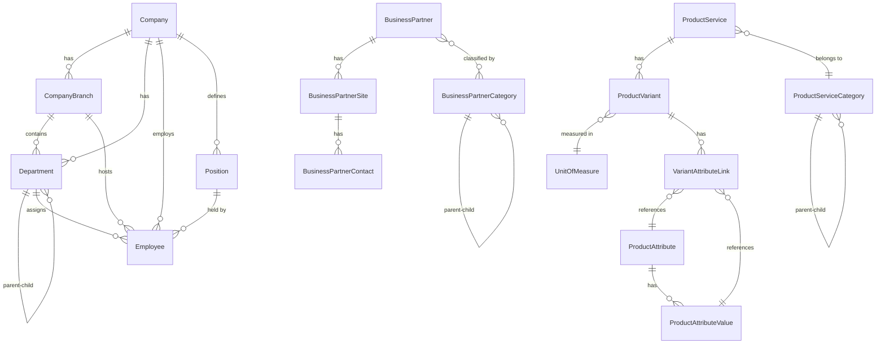

# VNS ERP 2026 — Phase 3: Master Data Module
## Business & System Specification Document

| **Version** | 1.0 |
|---|---|
| **Date** | 2026-03-03 |
| **Branch** | `feature/phase3-master-data` |
| **Author** | AI Solution Architect (auto-generated by reverse-engineering Domain & Application layers) |
| **Status** | Draft — Pending Stakeholder Review |

---

## 1. Module Overview

### 1.1 Purpose

The **Master Data Module** provides centralized management of foundational reference data that underpins all transactional modules in the VNS ERP 2026 system. Master Data represents the "who, what, and where" of the enterprise:

- **Who** — Company structure (departments, employees, positions) and Business Partners (customers, suppliers, contacts)
- **What** — Products, services, and their variants with configurable attributes
- **Where** — Branches, partner sites, and address management

### 1.2 Scope

This module covers **Create, Read, and Update** operations for **16 domain entities** organized into three functional groups:

| Group | Entity Count | Entities |
|---|---|---|
| **Organization / HR** | 5 | Company, CompanyBranch, Department, Employee, Position |
| **Business Partner** | 4 | BusinessPartner, BusinessPartnerCategory, BusinessPartnerContact, BusinessPartnerSite |
| **Product / Service Catalog** | 7 | ProductService, ProductServiceCategory, UnitOfMeasure, ProductAttribute, ProductAttributeValue, ProductVariant, VariantAttributeLink |

### 1.3 Technology Stack

| Layer | Technology |
|---|---|
| Domain | Pure C# entities inheriting from `AuditableEntity` |
| Application | MediatR (CQRS), AutoMapper, DTOs |
| Infrastructure | EF Core 10, PostgreSQL |
| Frontend | Blazor Server + DevExpress Components |

---

## 2. Actors & Permissions

Based on the RBAC system established in Phase 2, the following matrix defines access control:

| Role | Organization/HR | Business Partners | Product Catalog | Notes |
|---|---|---|---|---|
| **SuperAdmin** | Full CRUD | Full CRUD | Full CRUD | Unrestricted system access |
| **Admin** | Full CRUD | Full CRUD | Full CRUD | Company-level administration |
| **Manager** | Read + Limited Update | Full CRUD | Full CRUD | Can manage partners and products within their scope |
| **User** | Read Only | Read Only | Read Only | Standard operational access |
| **Guest** | No Access | No Access | No Access | Must authenticate first |

> [!IMPORTANT]
> **Authorization enforcement** is not implemented in the CQRS handlers themselves. It will be enforced at the **Blazor component level** using `<AuthorizeView>` and `[Authorize(Roles = "...")]` attributes as part of Task 3.4 (UI).

---

## 3. Data Dictionary

### 3.1 Common Base Fields (Inherited by ALL Entities)

Every entity inherits from `AuditableEntity`, which provides:

| Field | Type | Required | Description |
|---|---|---|---|
| `Id` | `Guid` | ✅ Auto-generated | Primary key (UUID v4) |
| `CreatedDate` | `DateTime` | ✅ Auto-set | UTC timestamp when record was created |
| `ModifiedDate` | `DateTime?` | ❌ | UTC timestamp of last modification |
| `CreatedBy` | `string?` | ❌ | Username/ID of the creating user |
| `ModifiedBy` | `string?` | ❌ | Username/ID of the last modifying user |

### 3.2 Enumerations

| Enum | Values | Used By |
|---|---|---|
| `Gender` | `Male`, `Female`, `Other` | Employee, BusinessPartnerContact |
| `PartnerType` | `Customer`, `Supplier`, `Both` | BusinessPartner |
| `SiteType` | `HeadOffice`, `Branch`, `Warehouse`, `Factory` | BusinessPartnerSite |

---

### 3.3 Organization / HR Group

#### 3.3.1 Company

The **root entity** representing the legal business entity. All organizational data is scoped under a company.

| Field | Type | Required | Business Rule |
|---|---|---|---|
| `CompanyCode` | `string` | ✅ | Unique identifier code (e.g., "VNS") |
| `CompanyName` | `string` | ✅ | Official registered company name |
| `ShortName` | `string?` | ❌ | Abbreviated name for display |
| `TaxCode` | `string?` | ❌ | Government tax identification number |
| `RepresentativeName` | `string?` | ❌ | Legal representative full name |
| `RepresentativeTitle` | `string?` | ❌ | Representative title (e.g., "CEO", "Director") |
| `Phone` | `string?` | ❌ | Main office telephone |
| `Fax` | `string?` | ❌ | Fax number |
| `Email` | `string?` | ❌ | Corporate email |
| `Website` | `string?` | ❌ | Company website URL |
| `Address` | `string?` | ❌ | Registered office address |
| `City` | `string?` | ❌ | City |
| `Country` | `string?` | ❌ | Country |
| `Logo` | `byte[]?` | ❌ | Company logo (binary) |
| `IsActive` | `bool` | ✅ | Soft-delete flag (default: `true`) |
| `Notes` | `string?` | ❌ | Free-text notes |

**Relationships:** Company → CompanyBranch (1:N), Company → Department (1:N), Company → Employee (1:N), Company → Position (1:N)

---

#### 3.3.2 CompanyBranch

A **physical location** of the company (head office, branch office, etc.).

| Field | Type | Required | Business Rule |
|---|---|---|---|
| `CompanyId` | `Guid` | ✅ | FK → Company |
| `BranchCode` | `string` | ✅ | Unique within the company |
| `BranchName` | `string` | ✅ | Branch display name |
| `Address` | `string?` | ❌ | Physical address |
| `City` | `string?` | ❌ | City |
| `Phone` | `string?` | ❌ | Branch phone |
| `Fax` | `string?` | ❌ | Branch fax |
| `Email` | `string?` | ❌ | Branch email |
| `ManagerName` | `string?` | ❌ | Name of branch manager |
| `SortOrder` | `int` | ✅ | Display ordering |
| `IsActive` | `bool` | ✅ | Soft-delete flag |
| `Notes` | `string?` | ❌ | Free-text notes |

**Relationships:** CompanyBranch → Department (1:N), CompanyBranch → Employee (1:N)

---

#### 3.3.3 Department

Organizational unit supporting a **self-referencing tree hierarchy** (parent → sub-departments).

| Field | Type | Required | Business Rule |
|---|---|---|---|
| `CompanyId` | `Guid` | ✅ | FK → Company |
| `BranchId` | `Guid?` | ❌ | FK → CompanyBranch (optional) |
| `ParentDepartmentId` | `Guid?` | ❌ | FK → Department (self-reference for tree) |
| `DepartmentCode` | `string` | ✅ | Unique department code |
| `DepartmentName` | `string` | ✅ | Department display name |
| `Description` | `string?` | ❌ | Description of the department's function |
| `SortOrder` | `int` | ✅ | Display ordering |
| `IsActive` | `bool` | ✅ | Soft-delete flag |

**Relationships:** Department → SubDepartments (1:N self-ref), Department → Employee (1:N)

---

#### 3.3.4 Employee

The most **field-rich entity** — represents an individual staff member with personal, contact, work, banking, and tax information.

| Field | Type | Required | Business Rule |
|---|---|---|---|
| `CompanyId` | `Guid` | ✅ | FK → Company |
| `BranchId` | `Guid?` | ❌ | FK → CompanyBranch |
| `DepartmentId` | `Guid?` | ❌ | FK → Department |
| `PositionId` | `Guid?` | ❌ | FK → Position |
| `EmployeeCode` | `string` | ✅ | Unique employee ID |
| `FullName` | `string` | ✅ | Full name (Vietnamese format) |
| `Gender` | `Gender?` | ❌ | Enum: Male / Female / Other |
| `BirthDate` | `DateTime?` | ❌ | Date of birth |
| `IdentityNumber` | `string?` | ❌ | CCCD / CMND number |
| `IdentityIssueDate` | `DateTime?` | ❌ | Issue date |
| `IdentityIssuePlace` | `string?` | ❌ | Issuing authority |
| `Phone` | `string?` | ❌ | Landline |
| `Mobile` | `string?` | ❌ | Mobile phone |
| `Email` | `string?` | ❌ | Email address |
| `PermanentAddress` | `string?` | ❌ | Permanent address |
| `CurrentAddress` | `string?` | ❌ | Current residence |
| `HireDate` | `DateTime?` | ❌ | Employment start date |
| `ResignDate` | `DateTime?` | ❌ | Employment end date |
| `BankAccountNumber` | `string?` | ❌ | Salary bank account |
| `BankName` | `string?` | ❌ | Bank name |
| `BankBranch` | `string?` | ❌ | Bank branch |
| `PersonalTaxCode` | `string?` | ❌ | Personal income tax code |
| `SocialInsuranceNumber` | `string?` | ❌ | Social insurance number |
| `Avatar` | `byte[]?` | ❌ | Profile picture (binary) |
| `IsActive` | `bool` | ✅ | Employment status flag |
| `Notes` | `string?` | ❌ | Free-text notes |
| `ApplicationUserId` | `Guid?` | ❌ | Link to system login account |

---

#### 3.3.5 Position

Job title / role within a company, with a **manager level** flag.

| Field | Type | Required | Business Rule |
|---|---|---|---|
| `CompanyId` | `Guid` | ✅ | FK → Company |
| `PositionCode` | `string` | ✅ | Unique position code |
| `PositionName` | `string` | ✅ | Position title |
| `Description` | `string?` | ❌ | Job description |
| `IsManagerLevel` | `bool` | ✅ | Whether this position has managerial authority |
| `SortOrder` | `int` | ✅ | Display ordering |
| `IsActive` | `bool` | ✅ | Soft-delete flag |

**Relationships:** Position → Employee (1:N)

---

### 3.4 Business Partner Group

#### 3.4.1 BusinessPartner

Represents a **customer, supplier, or dual-role** external business entity.

| Field | Type | Required | Business Rule |
|---|---|---|---|
| `PartnerCode` | `string` | ✅ | Unique partner identifier |
| `PartnerName` | `string` | ✅ | Legal/trading name |
| `PartnerType` | `PartnerType?` | ❌ | Enum: Customer / Supplier / Both (default: Customer) |
| `TaxCode` | `string?` | ❌ | Tax identification |
| `Phone` | `string?` | ❌ | Main phone |
| `Email` | `string?` | ❌ | Main email |
| `Website` | `string?` | ❌ | Website URL |
| `Address` | `string?` | ❌ | Headquarters address |
| `City` | `string?` | ❌ | City |
| `Country` | `string?` | ❌ | Country |
| `Logo` | `byte[]?` | ❌ | Partner logo (binary) |
| `IsActive` | `bool` | ✅ | Soft-delete flag |
| `Notes` | `string?` | ❌ | Free-text notes |

**Relationships:** BusinessPartner → Categories (M:N), BusinessPartner → Sites (1:N)

---

#### 3.4.2 BusinessPartnerCategory

Grouping/classification of partners using a **self-referencing tree** (e.g., "Domestic Suppliers" → "Raw Material Suppliers").

| Field | Type | Required | Business Rule |
|---|---|---|---|
| `ParentCategoryId` | `Guid?` | ❌ | FK → self (tree hierarchy) |
| `CategoryCode` | `string?` | ❌ | Optional category code |
| `CategoryName` | `string` | ✅ | Category display name |
| `Description` | `string?` | ❌ | Description |
| `SortOrder` | `int` | ✅ | Display ordering |
| `IsActive` | `bool` | ✅ | Soft-delete flag |

---

#### 3.4.3 BusinessPartnerSite

A **physical location** belonging to a partner (head office, warehouse, factory, etc.).

| Field | Type | Required | Business Rule |
|---|---|---|---|
| `PartnerId` | `Guid` | ✅ | FK → BusinessPartner |
| `SiteCode` | `string` | ✅ | Unique site code within partner |
| `SiteName` | `string` | ✅ | Site display name |
| `SiteType` | `SiteType?` | ❌ | Enum: HeadOffice / Branch / Warehouse / Factory |
| `Address` | `string?` | ❌ | Street address |
| `District` | `string?` | ❌ | District/ward |
| `City` | `string?` | ❌ | City |
| `Province` | `string?` | ❌ | Province/state |
| `Country` | `string?` | ❌ | Country |
| `PostalCode` | `string?` | ❌ | ZIP/postal code |
| `Phone` | `string?` | ❌ | Site phone |
| `Email` | `string?` | ❌ | Site email |
| `GoogleMapUrl` | `string?` | ❌ | Google Maps link |
| `IsDefault` | `bool` | ✅ | Whether this is the primary site |
| `IsActive` | `bool` | ✅ | Soft-delete flag |
| `Notes` | `string?` | ❌ | Free-text notes |

**Relationships:** BusinessPartnerSite → Contacts (1:N)

---

#### 3.4.4 BusinessPartnerContact

A **person of contact** at a partner site.

| Field | Type | Required | Business Rule |
|---|---|---|---|
| `SiteId` | `Guid` | ✅ | FK → BusinessPartnerSite |
| `FullName` | `string` | ✅ | Contact person full name |
| `Position` | `string?` | ❌ | Job title at the partner |
| `Department` | `string?` | ❌ | Department at the partner |
| `Gender` | `Gender?` | ❌ | Enum: Male / Female / Other |
| `BirthDate` | `DateTime?` | ❌ | Date of birth |
| `Phone` | `string?` | ❌ | Landline |
| `Mobile` | `string?` | ❌ | Mobile phone |
| `Email` | `string?` | ❌ | Email address |
| `Fax` | `string?` | ❌ | Fax |
| `LinkedIn` | `string?` | ❌ | LinkedIn profile |
| `Skype` | `string?` | ❌ | Skype ID |
| `WeChat` | `string?` | ❌ | WeChat ID |
| `Avatar` | `byte[]?` | ❌ | Profile picture (binary) |
| `IsPrimary` | `bool` | ✅ | Whether this is the primary contact |
| `IsActive` | `bool` | ✅ | Soft-delete flag |
| `Notes` | `string?` | ❌ | Free-text notes |
| `ApplicationUserId` | `Guid?` | ❌ | Link to system portal account |

---

### 3.5 Product / Service Catalog Group

#### 3.5.1 ProductService

The **core catalog entity** representing a product or service offered/procured by the company.

| Field | Type | Required | Business Rule |
|---|---|---|---|
| `ProductCode` | `string` | ✅ | Unique SKU / service code |
| `ProductName` | `string` | ✅ | Display name |
| `IsService` | `bool` | ✅ | `true` = service, `false` = physical product |
| `Description` | `string?` | ❌ | Detailed description |
| `CategoryId` | `Guid?` | ❌ | FK → ProductServiceCategory |
| `Thumbnail` | `byte[]?` | ❌ | Product image (binary) |
| `IsActive` | `bool` | ✅ | Soft-delete flag |

**Relationships:** ProductService → Variants (1:N)

---

#### 3.5.2 ProductServiceCategory

**Self-referencing tree** for grouping products/services (e.g., "Electronics" → "Laptops" → "Gaming Laptops").

| Field | Type | Required | Business Rule |
|---|---|---|---|
| `ParentCategoryId` | `Guid?` | ❌ | FK → self (tree) |
| `CategoryCode` | `string?` | ❌ | Optional code |
| `CategoryName` | `string` | ✅ | Category name |
| `Description` | `string?` | ❌ | Description |
| `SortOrder` | `int` | ✅ | Display ordering |
| `IsActive` | `bool` | ✅ | Soft-delete flag |

---

#### 3.5.3 UnitOfMeasure

**Lookup table** for measurement units used across variants and inventory.

| Field | Type | Required | Business Rule |
|---|---|---|---|
| `UnitCode` | `string` | ✅ | Unique code (e.g., "KG", "PCS", "SET") |
| `UnitName` | `string` | ✅ | Display name (e.g., "Kilogram", "Pieces") |
| `Description` | `string?` | ❌ | Description |
| `IsActive` | `bool` | ✅ | Soft-delete flag |

---

#### 3.5.4 ProductAttribute

Defines a **configurable attribute dimension** (e.g., "Color", "Size", "Material").

| Field | Type | Required | Business Rule |
|---|---|---|---|
| `AttributeName` | `string` | ✅ | Attribute name |
| `DataType` | `string` | ✅ | Expected data type (e.g., "Text", "Number", "Color") |
| `Description` | `string?` | ❌ | Description |

**Relationships:** ProductAttribute → Values (1:N)

---

#### 3.5.5 ProductAttributeValue

A **specific value** for an attribute (e.g., "Red", "Blue" for attribute "Color").

| Field | Type | Required | Business Rule |
|---|---|---|---|
| `ProductAttributeId` | `Guid?` | ❌ | FK → ProductAttribute |
| `Value` | `string` | ✅ | The attribute value |

---

#### 3.5.6 ProductVariant

A **specific SKU variation** of a product (e.g., "iPhone 16 — 128GB — Black").

| Field | Type | Required | Business Rule |
|---|---|---|---|
| `ProductId` | `Guid?` | ❌ | FK → ProductService |
| `VariantCode` | `string` | ✅ | Unique variant/SKU code |
| `VariantFullName` | `string?` | ❌ | Computed full name (Product + attributes) |
| `VariantNameForReport` | `string?` | ❌ | Short name for printed reports |
| `UnitId` | `Guid?` | ❌ | FK → UnitOfMeasure |
| `Thumbnail` | `byte[]?` | ❌ | Variant-specific image |
| `IsActive` | `bool` | ✅ | Soft-delete flag |

**Relationships:** ProductVariant → AttributeLinks (1:N)

---

#### 3.5.7 VariantAttributeLink

**Junction entity** connecting a Variant to a specific Attribute+Value pair. This is a three-way join table.

| Field | Type | Required | Business Rule |
|---|---|---|---|
| `ProductVariantId` | `Guid?` | ❌ | FK → ProductVariant |
| `ProductAttributeId` | `Guid?` | ❌ | FK → ProductAttribute |
| `ProductAttributeValueId` | `Guid?` | ❌ | FK → ProductAttributeValue |

---

## 4. Business Operations (Use Cases)

### 4.1 Operation Matrix

Every entity supports the following CQRS operations via MediatR:

| Operation | MediatR Pattern | Description |
|---|---|---|
| **List** | `Get[Entity]ListQuery` → `List<[Entity]Dto>` | Read-only list, filtered by parent FK where applicable, projected via AutoMapper `ProjectTo<>` for SQL efficiency |
| **Create** | `Create[Entity]Command` → `[Entity]Dto` | Creates a new record, sets `IsActive = true`, persists, returns mapped DTO |
| **Update** | `Update[Entity]Command` → `[Entity]Dto` | Loads by ID (throws `KeyNotFoundException` if missing), patches all fields, sets `ModifiedDate`, persists |

### 4.2 Query Filtering Strategy

Queries are scoped by parent entity where the data is hierarchically dependent:

| Query | Filter Parameter | Business Reason |
|---|---|---|
| GetCompanyListQuery | *(none — all)* | Top-level entity |
| GetCompanyBranchListQuery | `CompanyId` | Branches belong to a company |
| GetDepartmentListQuery | `CompanyId` | Departments belong to a company |
| GetEmployeeListQuery | `CompanyId` | Employees belong to a company |
| GetPositionListQuery | `CompanyId` | Positions belong to a company |
| GetBusinessPartnerListQuery | *(none — all)* | Top-level entity |
| GetBusinessPartnerCategoryListQuery | *(none — all)* | Flat list (tree rendered client-side) |
| GetBusinessPartnerSiteListQuery | `PartnerId` | Sites belong to a partner |
| GetBusinessPartnerContactListQuery | `SiteId` | Contacts belong to a site |
| GetProductServiceListQuery | *(none — all)* | Top-level entity |
| GetProductServiceCategoryListQuery | *(none — all)* | Flat list (tree rendered client-side) |
| GetUnitOfMeasureListQuery | *(none — all)* | Global lookup table |
| GetProductAttributeListQuery | *(none — all)* | Global dimension table |
| GetProductAttributeValueListQuery | `AttributeId` | Values belong to an attribute |
| GetProductVariantListQuery | `ProductId` | Variants belong to a product |
| GetVariantAttributeLinkListQuery | `VariantId` | Links belong to a variant |

### 4.3 Audit Trail

All entities inherit from `AuditableEntity`, which automatically tracks:

- **`CreatedDate`** — Set to `DateTime.UtcNow` on creation
- **`ModifiedDate`** — Set to `DateTime.UtcNow` on every update in the command handler
- **`CreatedBy` / `ModifiedBy`** — To be populated by the `ICurrentUserService` interceptor (Task 3.3)

### 4.4 Soft Delete Pattern

Entities use an `IsActive` flag rather than physical deletion:
- New records default to `IsActive = true`
- "Deleting" a record means setting `IsActive = false` via the `Update` command
- List queries will be filtered to `IsActive == true` in the UI layer

---

## 5. UI/UX Guidelines (Task 3.4)

### 5.1 General Screen Layout

Each Master Data entity should have a **List + Detail Form** pattern using DevExpress Blazor:

```
┌─────────────────────────────────────────────┐
│  [Breadcrumb: Master Data > Companies]       │
│  ┌────────────────────────────────────────┐  │
│  │  DxGrid (filterable, sortable, paged)  │  │
│  │  [+ New] [Export] [Filter Row]         │  │
│  │  ─────────────────────────────────────  │  │
│  │  Code | Name | Status | Actions        │  │
│  │  ...  | ...  | Active | [Edit][Delete]  │  │
│  └────────────────────────────────────────┘  │
│                                              │
│  DxPopup / DxFormLayout (Create/Edit Form)   │
│  ┌────────────────────────────────────────┐  │
│  │  Code: [________]  Name: [__________]  │  │
│  │  ...                                    │  │
│  │  [Save] [Cancel]                       │  │
│  └────────────────────────────────────────┘  │
└─────────────────────────────────────────────┘
```

### 5.2 Grid Column Recommendations

| Entity | Key Grid Columns | Sort Default | Row Filter |
|---|---|---|---|
| Company | Code, Name, ShortName, TaxCode, City, IsActive | Code ↑ | Yes |
| CompanyBranch | Code, Name, City, Manager, IsActive | SortOrder ↑ | Yes |
| Department | Code, Name, Parent, Branch, IsActive | SortOrder ↑ | Yes |
| Employee | Code, FullName, Department, Position, Mobile, IsActive | Code ↑ | Yes |
| Position | Code, Name, IsManager, IsActive | SortOrder ↑ | Yes |
| BusinessPartner | Code, Name, Type, TaxCode, Phone, IsActive | Code ↑ | Yes |
| BPCategory | Code, Name, Parent, IsActive | SortOrder ↑ | Yes |
| BPSite | Code, Name, Type, City, IsDefault, IsActive | Code ↑ | Yes |
| BPContact | FullName, Position, Phone, Email, IsPrimary | Name ↑ | Yes |
| ProductService | Code, Name, IsService, Category, IsActive | Code ↑ | Yes |
| PSCategory | Code, Name, Parent, IsActive | SortOrder ↑ | Yes |
| UnitOfMeasure | Code, Name, IsActive | Code ↑ | Yes |
| ProductAttribute | Name, DataType | Name ↑ | Yes |
| ProductAttrValue | Attribute, Value | Value ↑ | Yes |
| ProductVariant | Code, FullName, Unit, IsActive | Code ↑ | Yes |
| VariantAttrLink | Variant, Attribute, Value | — | No |

### 5.3 Form Validation Rules

| Rule | Fields | Implementation |
|---|---|---|
| **Required** | All fields marked "✅ Required" in Data Dictionary | `<DxFormLayoutItem>` with `RequiredMark` + server validation |
| **Unique Code** | `CompanyCode`, `BranchCode`, `EmployeeCode`, `PartnerCode`, `ProductCode`, `VariantCode`, `UnitCode` | Server-side duplicate check in Create/Update handlers (future enhancement) |
| **Email Format** | All `Email` fields | Regex validation |
| **Date Logic** | `ResignDate` ≥ `HireDate`, `IdentityIssueDate` ≤ today | Custom validator |
| **Self-Reference Guard** | Department.ParentDepartmentId ≠ self.Id | Prevent circular references |

### 5.4 Tree Views

Entities with `ParentCategoryId` / `ParentDepartmentId` should render as **DxTreeList** rather than flat grids:

- `Department` (ParentDepartmentId → tree)
- `BusinessPartnerCategory` (ParentCategoryId → tree)
- `ProductServiceCategory` (ParentCategoryId → tree)

### 5.5 Master-Detail Grids

Some entities are best displayed as **child grids** within their parent's detail view:

| Parent | Child Grid |
|---|---|
| Company | Branches, Departments, Employees, Positions |
| BusinessPartner | Sites |
| BusinessPartnerSite | Contacts |
| ProductService | Variants |
| ProductVariant | Attribute Links |
| ProductAttribute | Attribute Values |

---

## Appendix A: Entity Relationship Diagram



---

## Appendix B: File Inventory

| Layer | Path | File Count |
|---|---|---|
| Domain Entities | `Vns.Erp.Domain/MasterData/Entities/` | 16 |
| Domain Enums | `Vns.Erp.Domain/MasterData/Enums/` | 3 |
| Application DTOs | `Vns.Erp.Application/MasterData/DTOs/` | 16 |
| Application Queries | `Vns.Erp.Application/MasterData/Queries/` | 16 |
| Application Commands | `Vns.Erp.Application/MasterData/Commands/` | 32 |
| Application Mappings | `Vns.Erp.Application/MasterData/Mappings/` | 1 |
| **Total** | | **84** |
